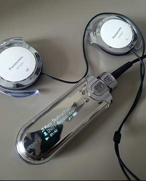

## Agustín Demarco - Presentación

### Información Personal
Soy Agustin Demarco, vivo en Escobar y tengo 19 años. Estudio ingeniería desde el año pasado porque siempre me interesó lo que hay debajo de la cubierta en aquellas herramientas tecnológicas que usamos a diario.

### Pasatiempos
- Ver deportes (fútbol, básquet, tenis, etc.).  
- Los juegos de estrategia por turnos.  
- Explorar distintos equipos y formatos de audio, ya que soy audiófilo. 

    
- Ir a la cancha de River cada fin de semana. 

    
- Ayudar en la empresa de logística de mis padres.

### Por qué estoy acá
Busco formarme como profesional, con bases sólidas para encarar el mundo laboral el día de mañana. Si bien todos cambiamos con el correr del tiempo, hoy me gustaría dedicarme al desarrollo de sistemas operativos y en un futuro muy lejano, ser mantenedor del kernel de linux. 